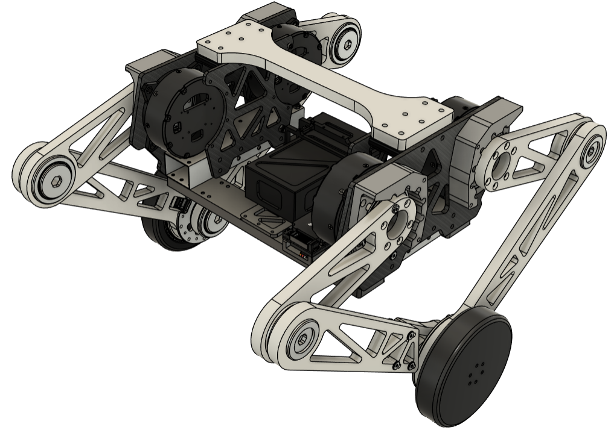
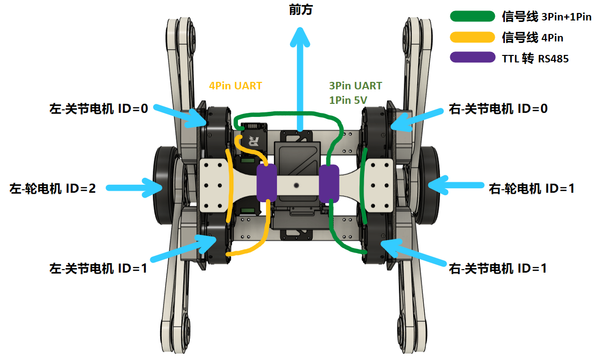

[中文版](./README.zh-CN.md) | [English Version](./README.en.md) 

# Project Introduction

## 0. Robot Display
  [Bilibili Video Link](https://www.bilibili.com/video/BV1Zm421P7HA/?spm_id_from=333.999.0.0&vd_source=4c878cdda4a827e2590557bcbb57b3e5)


## 1. File Description
- Mechanical: The file `平衡步兵-原型机-总装 v17.f3z` is the 3D model of the robot, modeled using Fusion
- Electrical control: The tool chain is `STM32CubeMX` + `arm-none-eabi-gcc` + `OpenOCD` + `VSCode` + `Makefile`
- Balance algorithm: Use serial PID, "bench model"


## 2. Mechanical Part (Body Parameters)

<div align="center">
  
</div>

- Joint motor upper swing angle = +20.0°
- Joint motor lower swing angle = -80.0°
- Development-Board-C distance from Body center distance (used for acceleration correction **code not used**)

```
  #define CENTER_IMU_W 0.11f        Gyroscope to Body center distance in X direction?  
  #define CENTER_IMU_L 0.074f       Gyroscope to Body center distance in Y direction?  
  #define CENTER_IMU_H 0.060f       Gyroscope to Body center height  
```

|    Part      | Weight kg | Length mm |
|-------------|-------|-------|
|Total mass        |8.235  |        |
|Main body          |5.215  |        |
|Main body center to simplified joint z direction distance||-14.5mm|
|Leg total weight (one side)  |1.5    ||
|Drive leg        |0.2    |150mm|
|Passive leg        |0.3    |270mm|
|Xiaomi motor      |0.317  |
|Wheel          |0.183  |62.2mm radius|

## 3. Electrical Control Part

The `tasks.json` file has 2 tasks:
  - `buildEmbeddedTargets` task is used as a Prelaunchtask in `lanuch.json`, to compile files before debugging, more convenient
  - `Download to STM` task is used to burn the program, the method is to enter `openocd -c` in the terminal to burn the .hex file

### 3.1 Motor Selection
- **Joint motor: Unitree A1**
  - Communication method: RS485 (need to use TTL to RS485 module driver)
  - Maximum series connection: 3 (so the left and right legs use 2+2, that is, one side of the leg is connected in series with two joint motors)
  - Single encoder (need to use mechanical limit, pull the leg back to zero every time it is powered on, hit the mechanical limit as zero)
- **Hub motor: XIAOMI Cyber Gear**
  - Communication method: CAN
  - Maximum series connection: very many
  - Single encoder

### 3.2 Opened peripherals
| Peripheral   | Description     |
| ---    | ---     |
| UART1  | Unitree A1 motor (mounted on APB? peripheral clock) (enable DMA)|
| UART6  | Unitree A1 motor (mounted on APB? peripheral clock) (enable DMA)|
| CAN1   | Control Xiaomi motor (mounted on APB? peripheral clock)|
| UART3  | Remote control reception |
| I2C2   | OLED|
| TIM4   | PWM buzzer (mounted on APB2 peripheral clock)|
| TIM10  | BMI088 PWM heating|
| SPI1   | BMI088 inertial measurement unit|
| I2C3   | IST8310 magnetometer|

### 3.3 **FreeRTOS**
|task |description |
|--------------|--------------------|
|OLED_Task     |Display OLED + receive remote control|
|Motor_A1_Task |Control A1 motor|
|Motor_MI_Task |Control MI motor|
|INS_task      |Posture calculation (DJI original program)|
|Robot_task    |Balance control algorithm|


### 3.4 **Motor Wiring and ID**
- **About A1 motor signal line**
  - let the XT30 port face up, from left to right are GND A B
  - The connection for RS485 is A to A, B to B, GND to GND

<div align="center">
  
</div>


### 3.5 Remote Control Operation Instructions
- **Left joystick**
  - Control the leg length up and down, pull down to lengthen the leg, pull up to shorten the leg
- **Right joystick** 
  - Control forward and backward
- **Left Trigger**
  - UP = leg locked at zero position
  - MIDDLE = leg position mode
- **Right Trigger**
  - UP = laying-down + remote control mode
  - MIDDLE = balancing + remote control mode
  - DOWN = balancing + tracking mode
- Attention: the tracking algorithm is not in this repository


## 4. Acknowledgements
- Thanks to night8858 for the open source A1 motor control code
- Thanks to 是小企鹅呀 for the open source Xiaomi micro motor control code
- Thanks to Dongguan University of Technology for sharing the electronic control document
- Thanks to HUNAN UNIVERSITY for the open source code of simulation and control
- Thanks to SHANGHAI JIAOTONG UNIVERSITY for the open source mechanical design
- Thanks to HARBIN INSTITUTE OF TECHNOLOGY for balancing algorithm instructions
