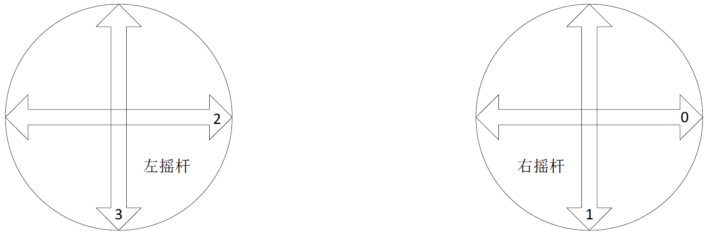
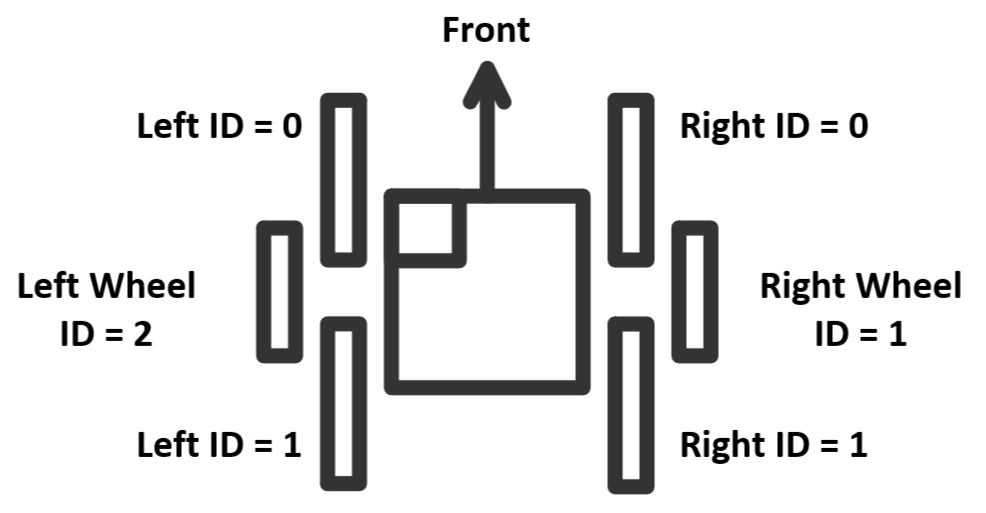

# 使用说明

`tasks.json` 文件中有 2 个任务：
  - `buildEmbeddedTargets` 任务作为 `lanuch.json` 中的 Prelaunchtask，在调试前先行编译文件，更方便
  - `Download to STM` 任务用于烧录程序，使用方法为在终端输入 `openocd -c` 烧录.hex文件

**开启的外设：**
| 外设   | 描述     |
| ---    | ---     |
| UART1  | 宇树A1电机 (挂载于APB?外设时钟)|
| UART6  | 宇树A1电机 (挂载于APB?外设时钟)|
| CAN1   | 控制小米电机 (挂载于APB?外设时钟)|
| UART3  | 遥控器接收 |
| I2C2   | OLED|
| TIM4   | PWM 蜂鸣器 (挂载于APB2外设时钟)|
| TIM10  | BMI088 PWM 加热|
| SPI1   | BMI088 惯性测量单元|
| I2C3   | IST8310 磁力计|
  

**FreeRTOS：**
|任务          |说明                |
|--------------|--------------------|
|OLED_Task     |显示OLED + 接收遥控器|
|Motor_A1_Task |控制A1电机|
|Motor_MI_Task |控制MI电机|
|INS_task      |姿态解算 (DJI原程序)|

  

  

## 机体参数
- 关节电机上摆角度 = +21.9
- 关节电机下摆角度 = -81.9
  
  |部件|重量 kg|长度 mm|
  |---|---|---|
  |总质量        |8.235||
  |主体          |5.215||
  |主体质心到简化关节z方向距离||-14.5mm|
  |腿总重(一侧)  |1.5  ||
  |驱动腿        |0.2  |150mm|
  |从动腿        |0.3  |270mm|
  |小米电机      |0.317||
  |轮子          |0.183|62.2mm 半径|

---

## 测试日志
- 2024.3.13
  - A1电机仅接AB就可以控制，不一定需要接GND
  
- 2024.3.18 
  - 使用示波器测试 UART1 UART6 TX GND
  - 注意: 示波器探针不要接到RX上，因为没有人给UART1发送数据，所以不会有任何示波器数据
  - 结论：
    - 可能是是转换器的问题
    - 宇树电机不需要通电也可以传递 RS485 信号，可以不开电查看电信号
    - A1_motor_speed_contrl 使用 UART1，并且确实在发送信号 

    | 设备 | 描述 |
    | --- | --- |
    | UART1 | 示波器有信号(4M 4.8M) |
    | TTL转RS485 | 示波器无信号 |
    | A1电机 | 示波器有波形 |

- 2024.3.20 
  - 示波器接在 A1 电机A+B端也可以看信号，不一定要接在A和GND
  - 测出信号，淘宝TTL转RS485中TX要接在TX上，因为这只是一个中继器，不要反接
  - 使用UART1转485听到电机起动噪声，确认**电机波特率为4.8M**
  - 发现我tmd居然没有在main.c中include "motor_A1.h"
  - 可以使用遥控驱动A1电机
  - 但是有些奇怪的异响
  - A1_Motor_Speed_Control 通过添加 HAL_Delay(1) 后可以同时控制两个电机
  - 发现问题：
    - TTL转485输出的电平明显比回传的电平低
    - 似乎电机转速与一开始的小米电机一样，是一档一档变化的
  
- 2024.3.21
  - A1_Motor_Position_Control 测试，可以使用，但是力道过猛
  - Send_data 数据类型有问题，通过对比GO1电机控制代码，应该是int16_t
  - 修改后电机成功正反转，但依然存在咔咔咔现象
  
- 2024.3.22
  - 发现电机位置模式在转动角度较大的情况下会好很多
  - 发现0号电机因为没有压紧轴承，原因为打印件过高
  - 使用电脑测试0力矩模式，没有出现咔咔咔现象
  - 使用C板测试0力矩模式，出现咔咔咔现象
  - 
  - 现推测 咔咔咔现象 为STM32通信问题
  - 仅输出一次速度控制信号，A1电机没有咔咔声，判断为信号存在问题，不是电机问题

- 2024.3.23
  - 推测电机咔咔咔为电平过低导致
  - 等待新TTL转485模块测试

    |控制端|电机模式|异响|延迟|发送信号|回传信号|
    |---|---|---|---|---|--|
    |电脑        |0力矩模式|❌|❌|有|无|
    |电脑        | 力矩模式|❌|❌|有|有|
    |电脑        | 位置模式|❌|❌|有|有|
    |电脑        | 速度模式|❌|❌|有|有|
    |C板 裸机    |0力矩模式|✔|✔|有|无|
    |C板 FreeRTOS|0力矩模式|✔|❌|有|无|

 - 2024.3.27 
   - 测试 A1_control.c 与 unitreeA1_cmd.c
   - 注意 unitreeA1_cmd.c 需要使用 uart DMA
   - A1_control.c 测试失败
   - unitreeA1_cmd.c 测试成功
   - A1 电机使用 unitreeA1_cmd.c 驱动成功，没有咔咔声
   - 
   - 当前可使用模式：位置模式+力矩模式+速度模式 (速度回传有点问题)
   - 原本速度模式用不了，osDelay调成5ms就可以了
   - 电机启动前添加osDay(1000)防止上电发疯
  
 - 2024.4.3
   - A1 Pos2需要外接编码器，本身没有
   - 现在可同时控制两腿 (速度模式)
   - 返回角度需要÷9.1减速比  
 - 2024.4.6
   - 现在可同时控制双腿 (位置模式)(默认上电时位置为0位)
 - 2024.4.7
   - A1电机下面那两个空闲接口不对外开放
   - 需要采用限位归零
  - 2024.4.11
    - 开始反向移植控制程序
    - [x] 移植 Motor_MI
    - [x] 移植 Motor_A1
    - [x] 移植 遥控器
    - Debug: USART3 Baud Rate 多打了个0 麻了
  - 2024.4.12
    - 开始移植 控制算法
    - [x] 测量机器人质量参数
    - [x] 测量机器人连杆长度
  - 2024.4.24
    - CubeMX 开启 DSP 函数库解决平衡算法缺失 arm_math.h 问题
## 任务列表
- [ ] PC模式
- [ ] 平衡算法
- [ ] 零位算法
- [ ] 小脚轮结构设计
- [x] 轮电机差速控制算法
- [ ] CAN 开启自检

## Fusion 重量设定
- [x] 电机 A1
- [x] 电机 MI
- [x] 电池
- [x] 大腿
- [x] 小腿
- [ ] 轮子 

## 结尾致谢
- 感谢 night8858 开源的 A1 电机控制代码
- 感谢 是小企鹅呀 开源的 小米微电机控制代码
- 感谢 湖南大学 跃鹿战队 开源的 Webots 轮腿机器人仿真
- 感谢 上海交通大学 开源的平衡步兵机械结构
- 感谢 哈尔滨工程技术大学 开源的平衡步兵控制理论文档